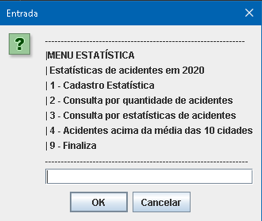
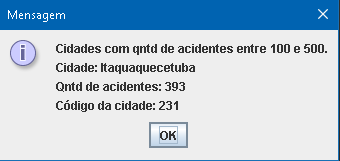
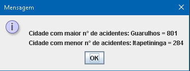
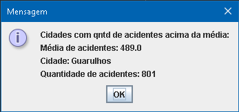
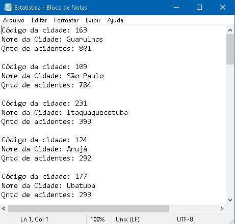
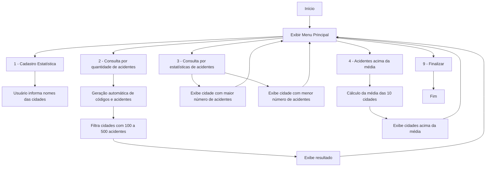

<div align="center">

# 📊 Sistema de Estatísticas de Acidentes

### Um projeto em **Java** para cadastrar, analisar e gerar relatórios de acidentes por cidade 🚗💥


---

[](https://www.oracle.com/java/)
[]()
[]()

</div>

---

## 🧠 Sobre o Projeto

Este sistema tem como objetivo **registrar e analisar estatísticas de acidentes** em 10 cidades diferentes.  
Cada cidade tem seu **código, nome e número de acidentes** — gerados parcialmente de forma automática.

O sistema exibe os dados por meio de janelas (`JOptionPane`) e também grava os resultados no arquivo `Estatistica.txt`.  
Ideal para **exercícios de lógica de programação, manipulação de arquivos e POO em Java**.

---

## 📸 Demonstração
### Menu principal do sistema
<p align="center">
  
</p>

## Relatório de estatísticas gerado
<p align="center">
  
</p>
<p align="center">
  
</p>
<p align="center">
  
</p>


## Arquivo Estatistica.txt gerado automaticamente
<p align="center">
  
</p>

## 🚀 Funcionalidades

✅ **Cadastro de estatísticas** com geração automática de código e número de acidentes.  
✅ **Filtragem de cidades** com acidentes entre 100 e 500.  
✅ **Identificação da cidade com maior e menor número de acidentes.**  
✅ **Cálculo da média geral** e listagem das cidades acima da média.  
✅ **Geração de arquivo `.txt`** com todos os resultados.a

---

## 🧩 Estrutura do Projeto

📁 Estatistica  
├── ClassePrincipal.java    # Classe principal com menu interativo  
├── ClasseMetodos.java      # Métodos e lógicas de processamento  
├── Estatistica.java        # Classe modelo (dados de cada cidade)  
└── Estatistica.txt         # Arquivo gerado automaticamente


---

## 🔄 Fluxo do Sistema



---

## 💾 Exemplo de Saída no Arquivo

- Código da cidade: 102
- Nome da Cidade: São Paulo
- Qntd de acidentes: 872
  
- Cidade com maior n° de acidentes: São Paulo = 872
- Cidade com menor n° de acidentes: Campinas = 112
  
- Cidades com qntd de acidentes acima da média:
- Média de acidentes: 534.2
- Cidade: São Paulo
- Quantidade de acidentes: 872


---

## 🧰 Tecnologias Utilizadas

| Tecnologia | Uso principal |
|-------------|----------------|
| ☕ **Java SE** | Linguagem base |
| 🪟 **JOptionPane (Swing)** | Interface de entrada e saída |
| 📄 **BufferedWriter / FileWriter** | Manipulação de arquivos |
| 🎲 **Random** | Geração automática de dados |

---

## ⚙️ Como Executar o Projeto

1. Clone este repositório:
   ```bash
   git clone https://github.com/emyrhf/Sistema-de-Transito.git
Abra o projeto em uma IDE Java (como NetBeans, Eclipse ou VS Code).

Compile e execute o arquivo:

```bash
Copiar código
ClassePrincipal.java
Interaja com o menu e observe os resultados gerados no arquivo Estatistica.txt.
```
👩‍💻 Autora
Emily Rharysa
💻 Desenvolvedora Web | Estudante de Tecnologia
📫 [LinkedIn](https://www.linkedin.com/in/emyrhf/)

