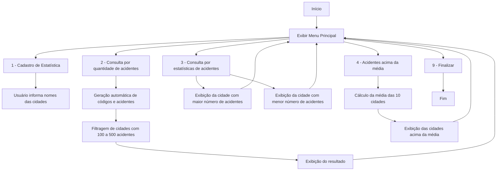

# Sistema de Estatísticas de Acidentes


Sistema em **Java** para cadastro, processamento e geração de relatórios estatísticos sobre acidentes de trânsito em um conjunto de dez cidades. A aplicação combina geração automática de dados (código da cidade e número de acidentes), interação via caixas de diálogo (`JOptionPane`) e persistência dos resultados em arquivo de texto (`Estatistica.txt`).

O projeto resolve um problema típico de disciplinas introdutórias de Programação Orientada a Objetos: consolidar, em um único sistema funcional, os fundamentos de manipulação de coleções/arrays, lógica condicional para cálculo de agregados estatísticos (média, máximo, mínimo, filtragem por faixa) e persistência simples em arquivo — sem depender de banco de dados ou frameworks externos.

---

## Sumário

1. [Contexto Acadêmico](#contexto-acadêmico)
2. [Arquitetura e Estrutura do Projeto](#arquitetura-e-estrutura-do-projeto)
3. [Pré-requisitos e Dependências](#pré-requisitos-e-dependências)
4. [Guia de Instalação e Execução](#guia-de-instalação-e-execução)
5. [Exemplos de Uso](#exemplos-de-uso)
6. [Metodologia e Decisões de Design](#metodologia-e-decisões-de-design)
7. [Funcionalidades](#funcionalidades)
8. [Licença e Contato](#licença-e-contato)

---

## Contexto Acadêmico

Este projeto foi desenvolvido como exercício prático de Programação Orientada a Objetos em Java, com foco em três eixos técnicos centrais: manipulação de estruturas de dados, lógica de processamento estatístico e persistência de dados em arquivo.

---

## Arquitetura e Estrutura do Projeto

O sistema é organizado em três classes Java com responsabilidades distintas, seguindo uma separação funcional entre apresentação (menu), lógica de processamento e modelo de dados:

```text
Estatistica/
├── ClassePrincipal.java   # Ponto de entrada da aplicação; menu interativo via JOptionPane
├── ClasseMetodos.java     # Lógica de processamento: geração de dados, filtros e cálculos estatísticos
├── Estatistica.java       # Classe de modelo: representa os dados de uma cidade (código, nome, acidentes)
└── Estatistica.txt        # Arquivo de saída gerado em tempo de execução
```

| Classe | Responsabilidade |
|---|---|
| `ClassePrincipal` | Exibe o menu principal e direciona o fluxo de execução conforme a opção selecionada pelo usuário. |
| `ClasseMetodos` | Concentra a lógica de negócio: geração automática de código/quantidade de acidentes, filtragem por faixa, identificação de máximo/mínimo, cálculo de média e gravação em arquivo. |
| `Estatistica` | Classe de modelo (POJO), representando o par código–nome–quantidade de acidentes de cada cidade. |

### Fluxo de execução



---

## Pré-requisitos e Dependências

| Requisito | Especificação |
|---|---|
| JDK (Java Development Kit) | **21 ou superior** |
| Bibliotecas externas | Nenhuma — utiliza exclusivamente a biblioteca padrão do Java |
| Pacotes da biblioteca padrão utilizados | `javax.swing.JOptionPane`, `java.io.BufferedWriter`, `java.io.FileWriter`, `java.util.Random` |
| Sistema de build | Não utilizado — compilação direta via `javac` |
| IDEs de referência utilizadas no desenvolvimento | NetBeans, Visual Studio Code |

---

## Guia de Instalação e Execução

### 1. Clonar o repositório

```bash
git clone https://github.com/emyrhf/Sistema-de-Transito.git
cd Sistema-de-Transito
```

### 2. Verificar a instalação da JDK

```bash
java -version
javac -version
```

### 3. Compilar o projeto

```bash
javac ClassePrincipal.java ClasseMetodos.java Estatistica.java
```

### 4. Executar a aplicação

```bash
java ClassePrincipal
```

A aplicação abrirá uma sequência de caixas de diálogo (`JOptionPane`) apresentando o menu principal. Ao final da execução (ou conforme as operações selecionadas), os resultados são gravados no arquivo `Estatistica.txt`, criado no diretório de execução.

---

## Exemplos de Uso

### Menu principal

O sistema apresenta as seguintes opções ao usuário:

```text
1 - Cadastro de Estatística
2 - Consulta por quantidade de acidentes
3 - Consulta por estatísticas de acidentes
4 - Acidentes acima da média
9 - Finalizar
```

### Saída gerada em `Estatistica.txt`

```text
Código da cidade: 102
Nome da Cidade: São Paulo
Qntd de acidentes: 872

Cidade com maior n° de acidentes: São Paulo = 872
Cidade com menor n° de acidentes: Campinas = 112

Cidades com qntd de acidentes acima da média:
Média de acidentes: 534.2
Cidade: São Paulo
Quantidade de acidentes: 872
```

> Os valores acima refletem o formato de saída documentado originalmente pelo projeto e servem como exemplo ilustrativo — os dados numéricos variam a cada execução, uma vez que o número de acidentes é gerado de forma pseudoaleatória (`java.util.Random`).

---

## Metodologia e Decisões de Design

**1. Separação entre modelo, lógica e apresentação.**
Embora o projeto não implemente o padrão MVC de forma estrita, há uma separação intencional de responsabilidades: `Estatistica` concentra o estado (dados de cada cidade), `ClasseMetodos` concentra as regras de processamento estatístico, e `ClassePrincipal` concentra a interação com o usuário. Essa divisão evita que a lógica de cálculo fique acoplada à camada de interface.

**2. Geração pseudoaleatória de dados.**
O número de acidentes por cidade é gerado por meio da classe `Random` da biblioteca padrão do Java, e não a partir de uma fonte de dados real (base pública de trânsito, por exemplo). *Trade-off*: os resultados não representam estatísticas reais de acidentes — a aplicação tem propósito exclusivamente didático/demonstrativo, adequado ao exercício de lógica de programação e não à análise de dados reais.

**3. Interface via `JOptionPane` (Swing).**
A escolha de caixas de diálogo do Swing, em vez de uma interface de terminal baseada em `Scanner`, permite uma interação mais visual sem a complexidade de construir uma interface gráfica completa (janelas, layouts, eventos). *Trade-off*: a interação é sequencial e modal, sem uma tela persistente de navegação.

**4. Persistência simples em arquivo texto.**
Os resultados são gravados em `Estatistica.txt` por meio de `BufferedWriter`/`FileWriter`, sem uso de banco de dados. Essa abordagem é adequada ao escopo do exercício (persistência de um relatório de saída), mas não oferece consulta estruturada, versionamento de registros ou controle de concorrência — limitações aceitáveis dado o caráter educacional do sistema.

---

## Funcionalidades

- Cadastro de estatísticas com geração automática de código de cidade e número de acidentes.
- Filtragem de cidades com número de acidentes entre 100 e 500.
- Identificação da cidade com maior e da cidade com menor número de acidentes.
- Cálculo da média geral de acidentes entre as dez cidades.
- Listagem das cidades com número de acidentes acima da média.
- Geração de arquivo `.txt` consolidando todos os resultados processados.

---

## Licença e Contato

**Licença:** este projeto é distribuído sob a **Licença MIT**. Isso permite uso, cópia, modificação, fusão, publicação, distribuição, sublicenciamento e/ou venda de cópias do software, desde que o aviso de copyright e a nota de permissão sejam incluídos em todas as cópias ou partes substanciais do software. O software é fornecido "no estado em que se encontra", sem garantias de qualquer tipo. Caso o arquivo `LICENSE` ainda não exista na raiz do repositório, recomenda-se sua criação com o texto oficial da licença MIT, disponível em [https://opensource.org/license/mit](https://opensource.org/license/mit).

**Autoria e manutenção:**

| Papel | Nome | Contato |
|---|---|---|
| Autora | Emily Furtado | emyrhf.dev@gmail.com |

**Repositório:** [https://github.com/emyrhf/Sistema-de-Transito](https://github.com/emyrhf/Sistema-de-Transito)

Contribuições, sugestões e relatos de problemas podem ser encaminhados por meio de *issues* no repositório.
